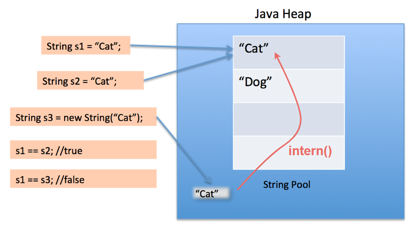

# [Java 11] String

Autor: [Gabriel Martins dos Santos - *Java Software Engineer*](https://linkedin.com/in/martinsgms)

Caderno pessoal de estudos para certificação OCJP11 (1z0-819).

---

### Conteúdo

- [Introdução](#introducao)
- [Construtores](#construtores)
- [Concatenação](#concatenacao)
- [Pool de Strings](#pool)
- [Principais métodos](#metodos)
- [Pegadinhas da prova](#pegadinhas)
- [Principais Exceptions](#exceptions)

---

## <a id="introducao"></a> Introdução
`java.lang.String` é uma classe **Wrapper** que encapsula um `char[]` (array de caracteres).

```` Java
public final class String
    implements java.io.Serializable,
    Comparable<String>, CharSequence,
    Constable, ConstantDesc {

    // ...

}
````
> Lembrando, todo Wrapper é *imutável*. Métodos chamados numa String não alteram o seu próprio valor. Em vez disso, *retornam uma referência para um novo objeto*.

## <a id="construtores"></a> Construtores
Existem duas formas básicas de obter um objeto de String:
- Inicialização literal
- Construtor

### Objeto via inicialização literal
Basicamente atribuir um valor de String diretamente à referência.
```` Java
    String nome = "Gabriel";
````

### Objeto via Construtor
Principais construtores:
```` Java
    new String("Olá mundo");
              (byte[])
              (char[])
              (StringBuilder)
              (StringBuffer)
````
> Cuidado! `new String(null)` não compila por ambiguidade, dado que há mais de um construtor com um argumento.
## <a id="concatenacao"></a> Concatenação
É a combinação de Strings. O compilador otimiza as concatenações de String, fazendo isso através de StringBuilder/StringBuffer.
Concatenação NÃO altera o valor da String. Um novo objeto é criado.
```` Java
    String nome = "gab";
    nome.concat("riel");
    System.out.println(nome); // gab
````
Para surtir efeito, a referência deve ser atualizada com o novo objeto.
```` Java
    String nome = "gab";
    nome = nome.concat("riel"); // gabriel
    // nome += "riel" // gabriel
    // nome += nome.concat("riel"); // gabgabriel
    System.out.println(nome);
````

### Concatenação com null
Concatenar com `null` é permitido, desde que seja com o operador `+`.
```` Java
    String valor = null;
    System.out.println("abc " + valor + " def"); // abc null def
    System.out.println("abc".concat(null) + "def"); // java.lang.NullPointerException: Cannot invoke "String.isEmpty()" because "str" is null
````
Isso porque o `.concat(str)` chama um `isEmpty()` internamente. Logo, se a referência for `null`, causará esta Exception.
## Concatenação com valores numéricos
Observar a precedência dos operadores e dos dados, da esquerda para a direita.
Concatenação ocorre **se e somente se um dos dois operandos forem String**, caso contrário o resultado é uma tentativa de operação aritmética.

Sumarizando:
```` Java
    System.out.println("a"+"b"); // ab
    System.out.println("a"+'b'); // ab
    System.out.println('a'+'b'); // 195
    System.out.println("a"+1); // a1
    System.out.println(1+"b"); // 1b
    System.out.println(1+"1"); // 11
    System.out.println(1+1); // 2
    System.out.println("1"+true); // 1true
    System.out.println("1"+null); // 1null
//		System.out.println('1'+true); // compile error
//		System.out.println('1'+null); // compile error
````

## <a id="pool"></a>  Pool de Strings



Toda String criada em **tempo de compilação** através de inicialização literal é inserida dentro de um pool para ser reutilizada. Logo, duas  referências de String literais com o mesmo conteúdo, são, na verdade, o mesmo objeto.
```` Java
    String nome = "gabriel";
    String outroNome = "gabriel";

    System.out.println(nome.equals(outroNome)); // true
    System.out.println(nome == outroNome); // true
````
Atenção ao tempo de compilação! Mesmo que a String possua o mesmo conteúdo, mas seja criada em **tempo de execução**, será criado um novo objeto. Portanto a igualdade irá resultar `false`.
```` Java
    String prefixo = "ga";
    String nomeComPrefixo = prefixo + "briel";
    System.out.println(nomeComPrefixo == nome); // false
````
A menos que seja chamado o método `intern()` que irá levar em conta a String do pool. Aí sim, neste caso, o resultado é `true`.
```` Java
    System.out.println(nomeComPrefixo.intern() == nome); // true
````

## <a id="igualdade"></a> Igualdade

## <a id="metodos"></a> Principais métodos

### Tamanho
| Nome  | O que faz
|-------|-------|
| `lenght()` : int | retorna o tamanho da String
```` Java
"JAVA".lenght() // 4
````

### Transformação
| Nome  | O que faz
|-------|-------|
| <sup>1</sup>`concat(String)` : String| concatena Strings*<sup>*</sup>*
| `toUppercase()`:String | toda a string maiúscula
| `toUppercase(Locale)`:String | idem, conforme padrões regionais
| `toLowercase()`:String | toda a string minúscula
| `toLowercase(Locale)`:String  | idem, conforme padrões regionais
| <sup>2</sup>`substring(int startInclusive, int endExclusive)`:String| extrai uma parte da String, dentro do range informado
| <sup>2</sup>`subSequence(int startInclusive, int endExclusive)`:String| idem
| `trim()`:String| remove espaços à direita e à esquerda
| `strip()`:String| idem
```` Java
"Java".concat(" 11") // Java 11
"Java".toUppercase() // JAVA
"Java".toLowercase() // java
"Java".substring(0, 2) // Ja
"Java".subSequence(0, 2) // Ja
"Java".substring(2) // va
"  Java  ".trim() // Java
"  Java  ".strip() // Java
````
### Igualdade
| Nome  | O que faz
|-------|-------|
| <sup>1</sup>`compareTo(String)`:int| compara o conteúdo case-sensitive
| <sup>1</sup>`compareToIgnoreCase(String)`:int| compara o conteúdo sem case-sensitive
```` Java
"JAVA".compareTo("java") // false
"JAVA".compareToIgnoreCase("java") // true
````
### Verificação
| Nome  | O que faz
|-------|-------|
| `isEmpty()`:boolean| `true` se lenght == 0
| `isBlank()`:boolean| `true` se lenght == 0 ou se possuir apenas espaços em branco

```` Java
"".isEmpty() // true
"".isBlank() // true

" ".isEmpty() // false
" ".isBlank() // true
````

### Busca
| Nome  | O que faz
|-------|-------|
| <sup>1</sup>`contains(CharSequence)`:boolean| verifica se a String possui a CharSequence informada
| <sup>2</sup>`charAt(int)`:char| retorna o char do index informado
| `indexOf(int)`:int| retorna o primeiro index do char/unicode informado
| <sup>3</sup>`indexOf(int, int)`:int| idem, a partir do index informado
| <sup>1 3</sup>`indexOf(String)`:int| retorna o primeiro index da String informada
| <sup>3</sup>`indexOf(String, int)`:int| idem, a partir do index informado
| <sup>1 3</sup>`lastIndexOf(...)`:int| mesmo que métodos acima, porém inicia a busca pelo final da String

```` Java
"Banana".contains("b") // false
"Banana".charAt(0) // B
"Banana".indexOf('a') // 1
"Banana".indexOf('a', 2) // 3
"Banana".lastIndexOf('a') // 5
"Banana".lastIndexOf('a', 2) // 1
````
### Métodos Estáticos
| Nome  | O que faz
|-------|-------|
| <sup>1</sup>`copyValueOf(char[])`:String|A fazer...
```` Java
//... A fazer...
````
---

> <sup>1</sup> &rarr; Lança `java.lang.NullPointerException (Runtime)` caso o argumento seja `null`.

> <sup>2</sup> &rarr; Lança `java.lang.StringIndexOutOfBoundsException (Runtime)` caso o index informado for negativo ou exceder o tamanho da String.

> <sup>3</sup> &rarr; Retorna `-1` caso o index informado for negativo ou exceder o tamanho da String.


## <a id="pegadinhas"></a> Pegadinhas da prova

- `replace(arg1, agr2)` &rarr; Se `agr1 == agr2`, *o mesmo objeto* é retornado, em vez de um `new`. Atenção nas questões sobre igualdade de String.

## <a id="exceptions"></a> Principais Exceptions
`java.lang.NullPointerException`  
`java.lang.StringIndexOutOfBoundsException`
``
``