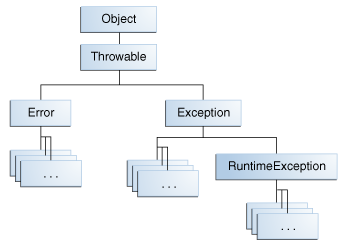

# Exceptions

Autor: [Gabriel Martins dos Santos - *Java Software Engineer*](https://linkedin.com/in/martinsgms)

Caderno de estudos para certificação OCJP11 (1z0-819).

---

## Hierarquia

### Error
São falhas graves e irrecuperáveis, relacionadas a JVM, ou algum componete *core* do sistema.

### Exception (checked)
São falhas previsíveis e recuperáveis. São checked porque o compilador te obriga a tratar.

### RuntimeException (unchecked)
O mesmo que sua superclasse. Porém, sendo unchecked o compilador não te obriga a tratar.

## Documentação oficial
https://docs.oracle.com/javase/tutorial/essential/exceptions/index.html