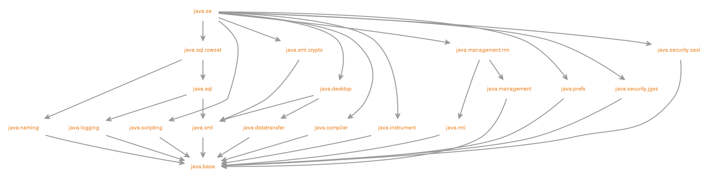

# Modules (java 9)

Autor: [Gabriel Martins dos Santos - *Java Software Engineer*](https://linkedin.com/in/martinsgms)

Caderno de estudos para certificação OCJP11 (1z0-819).

---

Módulos são conjuntos nomeados de pacotes, recursos e libs nativa.  
É o modo de aplicar forte encapsulamento ao projeto.
Cada módulo precisa ter o seu próprio diretório.

## Modular Jdk
Antes do java 9, o JDK era monolítico e enpacotado dentro de `rt.jar`. Ao longo do tempo o Java evoluiu e agora inclui internamente cerca de 25 frameworks. Mesmo que uma aplicação não use os 25 frameworks, eles estarão lá.  
Pacotes padrão do java possuem o prefixo `java.` ou `javax.`


### Listar módulos 
````bash
java --list-modules
#output
java.base@18.0.2.1
java.compiler@18.0.2.1
java.datatransfer@18.0.2.1
java.desktop@18.0.2.1
java.instrument@18.0.2.1
...
````
### Descrever módulo
````bash
java --describe-module java.sql
java -d java.sql
#output
java.sql@18.0.2.1
exports java.sql
exports javax.sql
requires java.base mandated
requires java.xml transitive
requires java.logging transitive
requires java.transaction.xa transitive
uses java.sql.Driver
````
### Verificar dependências
````bash
jdeps --print-module-deps --module java.sql
jdeps --print-module-deps -m java.sql
#output
java.base,java.logging,java.transaction.xa,java.xml
````
````bash
jdeps --list-reduced-deps --module java.sql
jdeps --list-reduced-deps -m java.sql
#output
java.base/jdk.internal.reflect
java.logging
java.transaction.xa
java.xml
````
````bash
jdeps --list-deps --module java.sql
jdeps --list-deps -m java.sql
#output
java.base/jdk.internal.reflect
java.logging
java.transaction.xa
java.xml
````

## Compilando um módulo
````bash
java --module-path . --module MyModule/com.gms.HelloWorld
java -p . -m MyModule/com.gms.HelloWorld
# output
O método main de HelloWorld.java será executado
````
`--module-path` se refere a localização do `module-info.java`

## Gerando o .jar
````bash
jar --create --file MyJar.jar --main-class com.gms.HelloWorld -C target/ .
# output
MyJar.jar
````

## Inspecionar o .jar
````bash
jar -f MyJar.jar --list
# output
arquivos dentro do jar
````
````bash
jar -f MyJar.jar -d
# output
descreve o módulo do .jar
````
````bash
java --module-path . --describe-module MyModule
java -p . -d MyModule
# output
descreve o módulo
````
````bash
jdeps MyModule.jar
# output
descreve as dependências do módulo
````